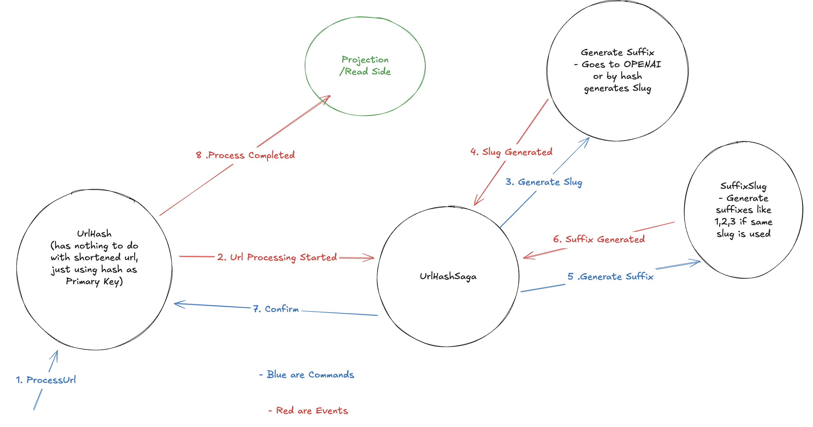

<div align="center">
  <h1>✨ URL Shortener ✨</h1>
</div>

This project is a URL shortener service built with F# and the Giraffe web framework. It allows users to submit a long URL and receive a shorter, unique slug that redirects to the original URL. It leverages LLM capabilities for enhanced functionality (e.g., intelligent slug generation).


## 🚀 Features

*   🔗 Shortens long URLs into unique slugs (potentially using LLM-based generation for more meaningful slugs).
*   ➡️ Redirects from slugs to the original URLs.
*   🔌 API endpoint for creating slugs (`/api/slug`).
*   🛡️ Rate limiting on the API endpoint.
*   🧠 Uses a CQRS pattern for handling data.
*   ⚙️ Configuration via HOCON files.

## 🤔 Why This Project?

*   Provide a simple and efficient URL shortening service.
*   Explore the integration of LLMs in a practical web application.
*   Demonstrate building web services with F# and Giraffe.

## 🏗️ Architecture

This project demonstrates the **CQRS (Command Query Responsibility Segregation)** pattern implementation in F#. The diagram below illustrates the flow of commands and queries through the system:

<div align="center">
  
  <p><em>CQRS Flow: Commands and Queries are handled separately for better scalability and maintainability</em></p>
</div>

## 🛠️ Building and Running

### Prerequisites

- **Requires .NET 9 SDK**

### Environment Variables (for AI Mode)

For AI-powered slug generation, the following environment variables are required:

```bash
OPENAI_API_KEY=your_openai_api_key_here
ASSISTANT_ID=your_assistant_id_here
```

#### Setting up OpenAI Assistant

To use AI mode, you need to create an assistant in OpenAI with the following prompt:

```
Analyze the input text. Identify two primary keywords or the most salient short words.
Combine these into a lowercase URL slug, `keyword1_keyword2`.
The slug must be under 15 characters total.
Return only the slug.
```

If these environment variables are not set, the application will run in **hash mode** (fallback to hash-based slug generation).

### Build and Run Commands

1. **Restore tools:**
   ```bash
   dotnet tool restore
   ```

2. **Restore dependencies:**
   ```bash
   dotnet paket restore
   ```

3. **Run the project:**
   ```bash
   dotnet run --project src/Server
   ```

4. **Access the application:**
   
   Visit: [http://localhost:5000](http://localhost:5000)

## 🤝 Contributing

Contributions are welcome! If you have ideas for improvements or find any issues.

## 📄 License

This project is licensed under the MIT License. See the [LICENSE](LICENSE) file for details. 